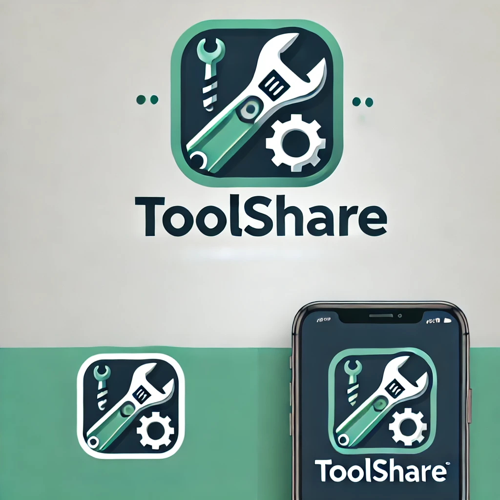

# :wrench: ToolShare :carpentry_saw:

## Product :iphone: :hammer:

ToolShare is a community-driven platform that lets you rent tools like drills, lawn mowers, and more from your neighbors. Why buy expensive equipment when you can borrow it locally? Easily browse available tools, rent what you need, and save money while fostering a sense of community. Share your own tools, earn extra cash, and help reduce waste by making resources accessible to everyone around you.   

With ToolShare, renting and sharing tools is simple:

* Rent out: List your tool with a picture, brand, age, skill level required, and set a price per day.
* Rent: Browse available tools, select what you need, specify how long you want it, and share your experience level.
* What if things break?: We recommend signing up for our insurance. If a tool breaks, we’ll replace it and ensure the owner gets a new one.
Easy!!!


Link to get to the milestones: 

[Milestone 1](/documentation/milestone1.md) <br>
[Milestone 2](/documentation/milestone2.md) <br>
[Milestone 3](/documentation/milestone3.md) <br>
[Milestone 4](/documentation/milestone4.md) <br>
[Milestone 5](/documentation/milestone5.md) <br>

## How to execute ToolShare

Running 

```bash
    make full-test
```
builds the containers and runs the application and database containers, launches the tests in a seperated container and afterwards dismentels everything. 

If one wants to create a user and add items one can run:

```bash
    make build
    make up
```

and then run commands to register:
```bash
curl -X POST "http://127.0.0.1:8000/register" -H "Content-Type: application/json" -d '{"username": "usertest", "password": "passwordtest"}'
```

create a token:
```bash
curl -X POST "http://127.0.0.1:8000/token" -H "Content-Type: application/x-www-form-urlencoded" -d "username=usertest&password=passwordtest"
```

and add items 
```bash
curl -X POST "http://127.0.0.1:8000/" -H "Authorization: Bearer <token_here>" -H "Content-Type: application/json" -d '{
    "name": "Heavy-Duty Hammer",
    "description": "hammer",
    "price": 20.0,
    "category": "tools"
}'
```