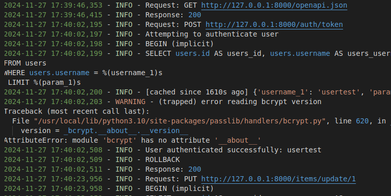

# :three: Milestone 3

## Setting up the Framework

### Logger
I added a logger to help understand what happens under the hood. This is useful for debugging and monitoring the application. The logger is set up to write to a file, so I can check it later if needed.
It notes the time, the information level, and the message. This way, I can see what’s happening in the application and when it happened.

### Seperating Business Logic and API
In this step the codebase was refactored to separate the business logic from the API. This makes the code cleaner and easier to understand. The API is now responsible for handling requests and responses, while the business logic is responsible for processing the data. This separation makes it easier to test the business logic and reuse it in other parts of the application.
Overall we work with the follwing structure: 

- **dependencies/**
  - `auth.py`
  - `db.py`
- **routers/**
  - `auth.py`
  - `items.py`
  - `users.py`
- **schemas/**
  - `auth.py`
  - `item.py`
  - `user.py`
- **services/**
  - `auth_service.py`
  - `item_service.py`
  - `user_service.py`
- **utils.py**
  - `logger.py`
- **main.py**

### Adding Documentation to the API
I added a documentaion to the FASTAPI application in the web (/docs) and in the JSON format (/redoc). This makes it easier for other developers to understand how to use the API and what endpoints are available. The documentation includes information about the endpoints, request and response formats, and example requests and responses. This makes it easier to work with the API and reduces the need to refer to the codebase for information.

### Environemts for Testing and Production

Secrete Key and Database URL are now stored in a .env file. This makes it easier to manage the configuration for different environments. The .env file is used to store sensitive information that should not be checked into version control. This makes it easier to deploy the application to different environments without having to change the codebase.

### Update Makefile

I added lint and format commands to the Makefile. This makes it easier to check the code for style issues and automatically fix them. The lint command uses flake8 to check the code for style issues, while the format command uses black to automatically format the code. This helps to ensure that the codebase is consistent and follows best practices.

### Adding Tests 
I added negative tests to the test suite. This tests the application with invalid input to make sure it handles errors correctly. This helps to ensure that the application is robust and can handle unexpected input without crashing. I also added tests for the isolation of the application. This tests the application with multiple users to make sure that each user's data is kept separate. This helps to ensure that the application is secure and that users can only access their own data. Finally, I added tests for unauthorized access to the application. This tests the application with invalid authentication to make sure it blocks unauthorized access. This helps to ensure that the application is secure and that only authorized users can access the data.

