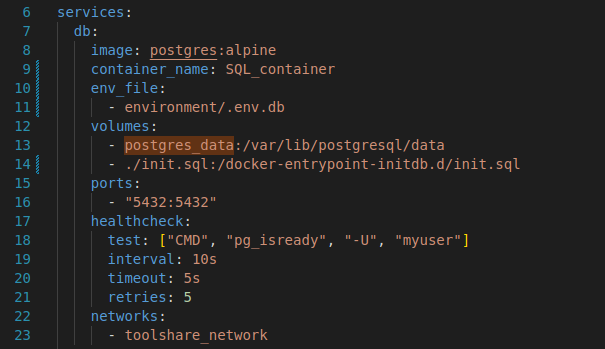
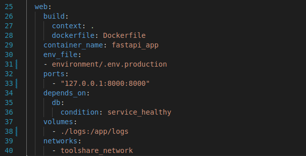
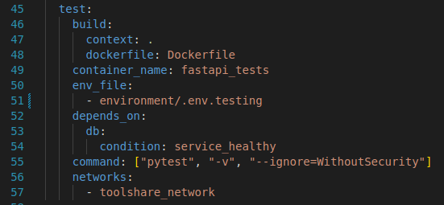
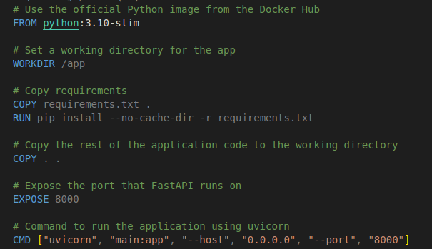

# 🎯 Milestone 4

## 🔧 ToolShare  
**Version 1.4**

---

## 🚀 Containerization

### 1. **Container Cluster Structure Documentation**

---

### 1.1 **Overview**

To ensure **scalability** and **isolation**, the web application runs in **three separate Docker containers**, defined and launched using a **`docker-compose`** file:  
1. **Web Application Container**  
2. **Database Container**  
3. **Test Container**

---

### 1.2 **Custom Network**

As a first step, a **custom network** is defined to allow communication between all containers:

```yaml
networks:
    toolshare_network:
```

### 1.2 **Database Container**



In the first container I stored the database, more precisely I used the PostgreSQL Database. Therefore I used the official lightweight `postgres:alpine` image. As a next required step is to import the environment, which defines the PostgresSQL credentials. In this step a database is automatically created. Further I mounted two valumes: `postgres_data` is used to avoid data loss between container restarts and Maps to `/var/lib/postgresql/data` inside the container. `./init.sql` is a SQL file that is executed at startup and builds the initial test database state. For ports I used the default ports of PostgreSQL. Health check are used to verify if the database is ready. 

## 1.3 Web-application-Container



This container is used to run the web application and is build on the Dockerfile. I import the environment which provides the DATABASE_URL and the SECRET_KEY. For port mapping from the host port inside the contianer I used the default 8000 from FastAPI, but restict the use to localhost only. To guarantee functionality this container depends on the health of the DB-Container. To make debugging easier and to allow monitoring we log the system and write it in a log file and inside the container. 

## 1.4 Test-Container



This container works similar to the Web Service Container but uses a seperate database to not interfere with the original database and runs the `pytest` tests.


## 1.5 Dockerfile 



The Web Service and the Testing Services build their containers based on this Dockerfile. Therefore they use a lightweight Python image with Python 3.10. Next a working directroy inside the container is set up called `/app`. Next the requirement filed is coppied into the container and is executed. The requirement.txt file list all necessary packages that are needed to run the system. `COPY . .` coppies all other application from the host into the container. `EXPOSE 8000` tells Docker to expose port 8000 for the container. This is the port FastAPI will listen on when the container runs. `CMD`specifies default commands when the container is launched. 


