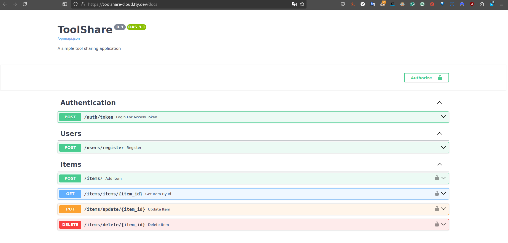
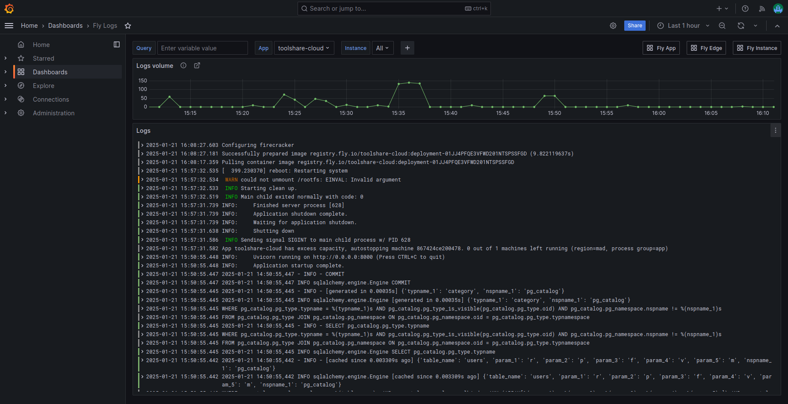

# 🎯 Milestone 4

## 🔧 ToolShare  
**Version 1.5**

---

## 🚀 Deployment in the Cloud

### 1. **The Cloud**


---

### 1.1 **Choosing a PaaS provider**

It is not easy to find a good cloud provider that fullfills the creterium of the execise and is free, or at least free for a period of time. Big names such as AWS, Google Cloud, and Azure are not free. Former students used Heroku, but it is not free anymore. So I was looking further. A youtube video recommended Fly.io. Fly.io is not for free but there is a 7 days trial period (not sure if this only works when you sign in with github) and if you spending does not exceed 5 $ you will not be charged. 


The benefit behind Fly.io is that it is easy to use and you can deploy your application with only a few commands. It has build in monitoring and logging, as well as security features. While it is not as big as AWS, Google Cloud or Azure, it is a good alternative for small projects.

### 1.2 **Deploying the Application**

Here is a guide how to set it up: https://fly.io/docs/getting-started/


To deploy the application on Fly.io, I first had to create an account. I chose the easierst why and singed in with my github account. After that one has to download the flyctl CLI (depending on the OS).

```bash
curl -L https://fly.io/install.sh | sh
```

After that I had to login with the CLI (this is only necessary once and if not registered one can also do it here with "fly auth signup"):

```bash
fly auth login
```


Now we launch the applciation with the following command:

```bash
fly launch
```


Before we can deploy our application we have to set up the database. We can do this in the Fly.io setting 


where I chose to use the managed database from Supabase (which is also free for a period of time).

Before we can deploy the apllication we have to set sectret environment variables. We can do this with the following command:

```bash
fly secrets set DATABASE_URL=postgresql://postgres: ..
```
we repeat this for the variables environment and secret key.

Fly.io automaticaly creats a "fly.toml" file which contains the configuration of the application. We can change the configuration in this file. 

```bash
# fly.toml app configuration file generated for toolshare-cloud on 2025-01-21T11:11:54+01:00
#
# See https://fly.io/docs/reference/configuration/ for information about how to use this file.
#

app = 'toolshare-cloud'
primary_region = 'mad'

[build]

[http_service]
  internal_port = 8000
  force_https = true
  auto_stop_machines = 'stop'
  auto_start_machines = true
  min_machines_running = 0
  processes = ['app']

[[vm]]
  size = 'shared-cpu-1x'
```

Now we can deploy the application with the following command:

```bash
fly deploy
```
the process runs and the application is deployed.

```bash
(base) victor@HP-Spectre:~/Granda/CC/ToolShare$ fly deploy
==> Verifying app config
Validating /home/victor/Granda/CC/ToolShare/fly.toml
✓ Configuration is valid
--> Verified app config
==> Building image
==> Building image with Depot
--> build:  (​)
[+] Building 30.6s (10/10) FINISHED                                                                  
...
--> Build Summary:  (​)
--> Building image done
image: registry.fly.io/toolshare-cloud:deployment-01JJ4RKPGBWKP4NNDPRS3YNJZ3
image size: 156 MB

Watch your deployment at https://fly.io/apps/toolshare-cloud/monitoring

-------
Updating existing machines in 'toolshare-cloud' with rolling strategy

-------
 ✔ Cleared lease for 867424ce200478
-------
Checking DNS configuration for toolshare-cloud.fly.dev


Visit your newly deployed app at https://toolshare-cloud.fly.dev/
```
and at the end we get the link to the application. When we open the application we do not see the interactive web page but when we add "/docs" we can see the interactive page.

Have fun with ToolShare. 




### 1.2 **Deploying GitHub Actions with Fly.io**

To deply the GitHub Actions with Fly.io we do not have to do a alog. A fly-deploy.yml file is already created in the repository. We only have to add the secrets to the repository. 

```bash
# See https://fly.io/docs/app-guides/continuous-deployment-with-github-actions/

name: Fly Deploy
on:
  push:
    branches:
      - main
jobs:
  deploy:
    name: Deploy app
    runs-on: ubuntu-latest
    concurrency: deploy-group    # optional: ensure only one action runs at a time
    steps:
      - uses: actions/checkout@v4
      - uses: superfly/flyctl-actions/setup-flyctl@master
      - run: flyctl deploy --remote-only
        env:
          FLY_API_TOKEN: ${{ secrets.FLY_API_TOKEN }}

```

To set the secrets we have to go to the repository settings and add the secrets. To get the key with have to run 

```bash
flyctl tokens create deploy -x 999999h
``` 
and paste it in the secrets. The name for the Token must be FLY_API_TOKEN if we do not want to make futher changes in the code. 

We end up with two Tokens one for the application and one for the GitHub Actions.


Now we can push the changes to the repository and the GitHub Actions will deploy the application.

### 1.3 **Monitoring and Logging**

Fly.io has a build in monitoring and logging system. We can see the logs in the terminal with the following command:

```bash
fly logs
```

but we can also use the tools procided within the Fly.io dashboard. 




This is it for the deployment in the cloud. I hope you enjoyed the journey.


